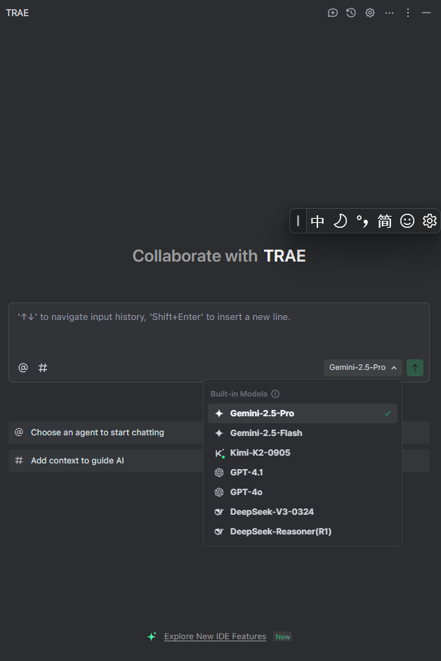

## Trae 介绍
Trae 是字节跳动于 2025 年推出的一款 AI 原生集成开发环境（AI IDE），全称为 The Real AI Engineer，旨在通过自然语言交互和智能协作，重新定义开发者的工作方式。它将大模型能力深度融入编程全流程，支持从需求描述到代码生成、调试、部署的端到端自动化开发，被视为 “真正的 AI 工程师”。
Trae 有单独的 IDE，就是 VSCode 套了个壳；也支持以插件形式安装，这里主要记录插件形式登录国际账号。
## Trae 插件登录国际版账号
1. 使用 ping 命令得到 `trae.ai` 的 IP 地址：`ping www.trae.ai`;
2. 修改 hosts 文件，添加这一行: `[trae.ai ip地址] www.trae.cn`;
3. 重新登录，授权。
